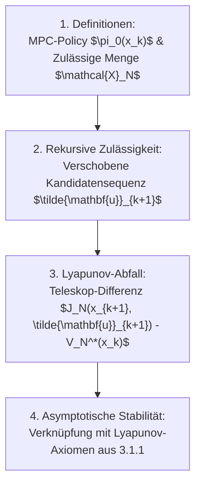

Viewed mpc.tex:1-152
Viewed discrete-sys-stability.tex:1-52
Listed directory inc
Listed directory mpc
Viewed intro.tex:1-6
Viewed stability-without-terminal.tex:1-36
Viewed mpc.tex:1-7
Searched for "citeSec"
Viewed cite_preamble.tex:1-58
Searched for "rawlingsModelPredictiveControl2020"

Die Rückmeldung deines Betreuers zielt darauf ab, die Lücke zwischen den **lokalen Eigenschaften der Terminal Ingredients (3.2.2)** und dem **globalen Beweis der Regelkreis-Stabilität (3.2.3)** formal sauber und nachvollziehbar zu schließen.

Bisher wurde in 3.2.3 lediglich behauptet, dass $V_N^*$ eine Lyapunov-Funktion ist und dass $V_N^*(x_{k+1}) - V_N^*(x_k) \leq -\ell(x_k, u_k)$ gilt. Für eine Masterarbeit fehlt hier der entscheidende Kernmechanismus: **Die Konstruktion der verschobenen Kandidatensequenz (*Warm-Start / Shifting*) und die daraus resultierende Teleskopsumme.**

---

### Was in 3.2.3 (und 3.2.2) konkret geändert werden muss

Dein Betreuer schlägt eine klare Strukturierung in 4 Kernfragen für **3.2.3** vor:



---

### Detaillierte mathematische Argumentation für 3.2.3

#### 1. MPC-Policy und zulässige Menge $\mathcal{X}_N$
- **Zulässige Menge $\mathcal{X}_N$:** Die Menge aller Anfangszustände $x \in \mathcal{X}$, für die das Optimierungsproblem \eqref{eq:mpc-problem} eine zulässige Lösung besitzt (d.h. alle Zustands-, Stellgrößen- und Endmengenbeschränkungen erfüllbar sind):
  $$\mathcal{X}_N := \left\{ x \in \mathcal{X} \;\middle|\; \exists \mathbf{u} \text{ s.t. } x_{0|k}=x, \, x_{i|k} \in \mathcal{X}, \, u_{i|k} \in \mathcal{U}, \, x_{N|k} \in \mathcal{X}_f \right\}.$$
- **MPC-Policy:** Nach dem Receding-Horizon-Prinzip wird nur das erste Element der optimalen Folge angewendet: $\pi_0(x_k) := u_{0|k}^*(x_k)$. Das geschlossene System evolviert gemäß:
  $$x_{k+1} = f(x_k, \pi_0(x_k)) = x_{1|k}^*.$$

#### 2. Rekursive Zulässigkeit via Shifting (Warum $x_k \in \mathcal{X}_N \implies x_{k+1} \in \mathcal{X}_N$)
Sei zum Zeitpunkt $k$ der Zustand $x_k \in \mathcal{X}_N$ mit der optimalen Eingangsfolge $\mathbf{u}^*(x_k) = \{u_{0|k}^*, u_{1|k}^*, \dots, u_{N-1|k}^*\}$ und der optimalen Zustandstrajektorie $\mathbf{x}^*(x_k) = \{x_{0|k}^*, x_{1|k}^*, \dots, x_{N|k}^*\}$ mit $x_{N|k}^* \in \mathcal{X}_f$.

Zum nächsten Zeitschritt $k+1$ (Ist-Zustand $x_{k+1} = x_{1|k}^*$) konstruieren wir eine **zulässige Kandidatensequenz $\tilde{\mathbf{u}}_{k+1}$**, indem wir die vorherige Sequenz um einen Zeitschritt nach links verschieben und die lokale Endregelung $\pi_f$ anhängen:
$$\tilde{\mathbf{u}}_{k+1} := \{ u_{1|k}^*, u_{2|k}^*, \dots, u_{N-1|k}^*, \pi_f(x_{N|k}^*) \}.$$
Die resultierende prädizierte Zustandstrajektorie ist:
$$\tilde{\mathbf{x}}_{k+1} := \{ x_{1|k}^*, x_{2|k}^*, \dots, x_{N|k}^*, f(x_{N|k}^*, \pi_f(x_{N|k}^*)) \}.$$

**Warum ist $\tilde{\mathbf{u}}_{k+1}$ garantiert zulässig für $x_{k+1}$?**
1. Für die Schritte $i = 0, \dots, N-2$: Die Paare $(\tilde{x}_{i|k+1}, \tilde{u}_{i|k+1}) = (x_{i+1|k}^*, u_{i+1|k}^*)$ erfüllen $\mathcal{X}$ und $\mathcal{U}$, da sie Teil der optimalen (und damit zulässigen) Lösung zum Zeitschritt $k$ waren.
2. Für den Schritt $i = N-1$: Da $x_{N|k}^* \in \mathcal{X}_f$, garantiert Eigenschaft \eqref{eq:term-input-constraint} ($\pi_f(\mathcal{X}_f) \subseteq \mathcal{U}$), dass $\tilde{u}_{N-1|k+1} = \pi_f(x_{N|k}^*) \in \mathcal{U}$.
3. Für den neuen Endzustand $\tilde{x}_{N|k+1} = f(x_{N|k}^*, \pi_f(x_{N|k}^*))$: Durch die **positive Invarianz** von $\mathcal{X}_f$ unter $\pi_f$ (Eigenschaft \eqref{eq:term-positive-invariance}) gilt $\tilde{x}_{N|k+1} \in \mathcal{X}_f \subseteq \mathcal{X}$.

Damit erfüllt die Kandidatensequenz alle Nebenbedingungen $\implies x_{k+1} \in \mathcal{X}_N$. Per Induktion ist $\mathcal{X}_N$ positiv invariant für den geschlossenen Regelkreis.

---

#### 3. Warum die optimale Kostenfunktion abnimmt (Lyapunov-Abfall)
Da $\tilde{\mathbf{u}}_{k+1}$ eine *zulässige*, aber nicht notwendigerweise *optimale* Steuersequenz für $x_{k+1}$ ist, gilt für das Optimum:
$$V_N^*(x_{k+1}) \leq J_N(x_{k+1}, \tilde{\mathbf{u}}_{k+1}).$$

Nun betrachten wir die Kostendifferenz $J_N(x_{k+1}, \tilde{\mathbf{u}}_{k+1}) - V_N^*(x_k)$:
$$J_N(x_{k+1}, \tilde{\mathbf{u}}_{k+1}) = \sum_{i=1}^{N-1} \ell(x_{i|k}^*, u_{i|k}^*) + \ell(x_{N|k}^*, \pi_f(x_{N|k}^*)) + V_f(f(x_{N|k}^*, \pi_f(x_{N|k}^*))),$$
$$V_N^*(x_k) = \ell(x_{0|k}^*, u_{0|k}^*) + \sum_{i=1}^{N-1} \ell(x_{i|k}^*, u_{i|k}^*) + V_f(x_{N|k}^*).$$

Beim Subtrahieren kürzt sich die innere Summe $\sum_{i=1}^{N-1} \ell(x_{i|k}^*, u_{i|k}^*)$ vollständig weg (**Teleskop-Effekt**):
$$J_N(x_{k+1}, \tilde{\mathbf{u}}_{k+1}) - V_N^*(x_k) = -\ell(x_k, u_{0|k}^*) + \underbrace{\left[ V_f(f(x_{N|k}^*, \pi_f(x_{N|k}^*))) - V_f(x_{N|k}^*) + \ell(x_{N|k}^*, \pi_f(x_{N|k}^*)) \right]}_{\leq \, 0}.$$

Da der eingeklammerte Term wegen \eqref{eq:term-cost-decrease} $\leq 0$ ist, folgt unmittelbar:
$$V_N^*(x_{k+1}) - V_N^*(x_k) \leq J_N(x_{k+1}, \tilde{\mathbf{u}}_{k+1}) - V_N^*(x_k) \leq -\ell(x_k, \pi_0(x_k)).$$

---

#### 4. Zusätzliche Annahmen für Asymptotische Stabilität
Der Abfall $V_N^*(x_{k+1}) - V_N^*(x_k) \leq -\ell(x_k, \pi_0(x_k))$ führt zur asymptotischen Stabilität, wenn die Bedingungen aus \cref{subsec:lyapunov-stability} erfüllt sind:
1. **Positivdefinitheit der Stufenkosten:** Da $Q \succ 0$, gilt $\ell(x_k, \pi_0(x_k)) \geq \lambda_{\min}(Q) \|x_k\|^2 > 0$ für alle $x_k \neq \mathbf{0}$.
2. **Obere und untere Schranken für $V_N^*(x)$:** $V_N^*(\mathbf{0}) = 0$, $V_N^*(x) \geq \ell(x, \pi_0(x)) > 0$ für $x \neq \mathbf{0}$, und $V_N^*(x)$ ist stetig / lokal nach oben durch eine $\mathcal{K}_\infty$-Funktion beschränkt.

Damit ist $V_N^*(x)$ eine echte Lyapunov-Funktion auf $\mathcal{X}_N$, und das geschlossene System ist auf $\mathcal{X}_N$ asymptotisch stabil.

---

### Vollständiger Formulierungsvorschlag für [mpc.tex](file:///home/josua/projects/ma/Masterthesis/inc/mpc/mpc.tex)

Hier ist die überarbeitete Fassung für die beiden Unterkapitel 3.2.2 und 3.2.3, abgestimmt auf die Zitations-Makros (`\citeSec`, `\citeThm`, `\citeEq`, etc.) und Notation deiner Arbeit:

```latex
\subsection{Terminal Ingredients and Their Construction}
\label{subsec:terminal-set-cost} 

To guarantee recursive feasibility and closed-loop stability of the nominal MPC scheme, 
the optimal control problem \labelcref{eq:mpc-problem} incorporates three central terminal ingredients: 
a terminal constraint set $\mathcal{X}_f \subseteq \mathcal{X}$, an auxiliary local control law 
$\pi_f: \mathcal{X}_f \to \mathcal{U}$, and a terminal cost function $V_f: \mathcal{X}_f \to \mathbb{R}_{\ge 0}$ 
\citeAsm{2.14,5.9}{rawlingsModelPredictiveControl2020,gruneNonlinearModelPredictive2017}.

Specifically, these ingredients must satisfy four fundamental conditions:
\begin{subequations}
    \label{eq:terminal-conditions}
    \begin{align}
        \mathcal{X}_f &\subseteq \mathcal{X}, \label{eq:term-state-constraint} \\
        \pi_f(x) &\in \mathcal{U}, \qquad &\forall x \in \mathcal{X}_f, \label{eq:term-input-constraint} \\
        f(x, \pi_f(x)) &\in \mathcal{X}_f, \qquad &\forall x \in \mathcal{X}_f, \label{eq:term-positive-invariance} \\
        V_f(f(x, \pi_f(x))) - V_f(x) &\leq -\ell(x, \pi_f(x)), \qquad &\forall x \in \mathcal{X}_f. \label{eq:term-cost-decrease}
    \end{align}
\end{subequations}

Each of these properties serves a distinct mathematical role in establishing stability:
\begin{itemize}
    \item \textbf{Admissibility \labelcref{eq:term-state-constraint,eq:term-input-constraint}:} Enforces that all states in $\mathcal{X}_f$ and the corresponding local control inputs remain strictly within the physical constraint sets $\mathcal{X}$ and $\mathcal{U}$.
    \item \textbf{Positive Invariance \labelcref{eq:term-positive-invariance}:} Ensures that any trajectory starting in $\mathcal{X}_f$ under the local controller $\pi_f$ remains in $\mathcal{X}_f$ for all future times \citeDef{2.9}{rawlingsModelPredictiveControl2020}. This property is essential for extending an optimal prediction horizon by one step to guarantee recursive feasibility.
    \item \textbf{Local Lyapunov Decrease \labelcref{eq:term-cost-decrease}:} Acts as a local Lyapunov descent condition, requiring the terminal cost $V_f$ to decrease along the autonomous terminal trajectory by at least the stage cost $\ell(x, \pi_f(x))$ \citeAsm{5.9}{gruneNonlinearModelPredictive2017}. This provides the crucial upper bound required to show the monotonic decrease of the optimal value function.
\end{itemize}

For nonlinear systems, these terminal ingredients are commonly designed by linearizing the nominal dynamics \labelcref{eq:discrete-time-system} around the equilibrium $(\mathbf{0}, \mathbf{0})$:
\begin{equation}
    \label{eq:linearized-system}
    x_{k+1} = A x_k + B u_k,
\end{equation}
where $A = \frac{\partial f}{\partial x}(\mathbf{0}, \mathbf{0})$ and $B = \frac{\partial f}{\partial u}(\mathbf{0}, \mathbf{0})$ denote the system Jacobians \citeSec{2.5.5}{rawlingsModelPredictiveControl2020}. 
Under the assumption that $(A, B)$ is stabilizable and $(A, Q^{1/2})$ is detectable, the unique stabilizing matrix $P \succ 0$ is obtained by solving the discrete-time Algebraic Riccati Equation (DARE) \citeEq{1.18,5.23}{rawlingsModelPredictiveControl2020,gruneNonlinearModelPredictive2017}:
\begin{equation}
    \label{eq:riccati-equation}
    P = A^\top P A - A^\top P B \left(R + B^\top P B\right)^{-1} B^\top P A + Q.
\end{equation}
The local feedback law $\pi_f(x) = -K x$ is then parameterized by the optimal Linear-Quadratic Regulator (LQR) gain
\begin{equation}
    \label{eq:lqr-feedback}
    K = \left(R + B^\top P B\right)^{-1} B^\top P A,
\end{equation}
and the terminal cost is chosen quadratically as $V_f(x) = x^\top P x$. 

Finally, the terminal set $\mathcal{X}_f$ is defined as an ellipsoidal sub-level set of the terminal cost:
\begin{equation}
    \label{eq:terminal-ellipse}
    \mathcal{X}_f := \left\{ x \in \mathbb{R}^{n_x} \ \middle|\ x^\top P x \leq \rho \right\}.
\end{equation}
By choosing the scaling parameter $\rho > 0$ sufficiently small, $\mathcal{X}_f$ satisfies both the input constraint $-K x \in \mathcal{U}$ and state constraint $x \in \mathcal{X}$, while ensuring that the quadratic decay under $P$ dominates higher-order nonlinear truncation errors of the actual nonlinear dynamics $f(x, -Kx)$ \citeSec{2.5.5}{rawlingsModelPredictiveControl2020}.

\begin{figure}[htbp]
    \centering
    \input{tikz/basics/sets.tex}
    \caption{Comparison of the terminal set $\mathcal{X}_f$ (red) with the entire state space $\mathcal{X}$ (blue).}
    \label{fig:terminal-set-comparison}
\end{figure}


\subsection{Recursive Feasibility and Closed-Loop Stability}
\label{subsec:closed-loop-stability}

Equipped with the terminal ingredients from \cref{subsec:terminal-set-cost}, the nominal closed-loop properties of MPC can be formally established.

\paragraph{MPC Policy and Feasible Set}
Let $\mathcal{X}_N \subseteq \mathcal{X}$ denote the \textit{feasible set} of the optimal control problem \labelcref{eq:mpc-problem}, defined as the set of all initial states for which an admissible solution exists:
\begin{equation}
    \label{eq:feasible-set}
    \mathcal{X}_N := \left\{ x \in \mathcal{X} \ \middle|\ \exists \{u_i\}_{i=0}^{N-1} \text{ s.t. } x_0 = x, \ x_i \in \mathcal{X}, \ u_i \in \mathcal{U}, \ x_N \in \mathcal{X}_f \right\}.
\end{equation}
For any $x_k \in \mathcal{X}_N$, let $\mathbf{u}^*(x_k) = \{u_{0|k}^*, u_{1|k}^*, \dots, u_{N-1|k}^*\}$ denote the optimal input sequence with corresponding optimal state trajectory $\mathbf{x}^*(x_k) = \{x_{0|k}^*, x_{1|k}^*, \dots, x_{N|k}^*\}$, where $x_{0|k}^* = x_k$ and $x_{N|k}^* \in \mathcal{X}_f$. The optimal value function is given by $V_N^*(x_k) = J_N(x_k, \mathbf{u}^*(x_k))$. Following the receding horizon strategy, the closed-loop MPC feedback policy $\pi_0: \mathcal{X}_N \to \mathcal{U}$ is defined by applying the first control input:
\begin{equation}
    \label{eq:mpc-feedback-policy}
    \pi_0(x_k) := u_{0|k}^*.
\end{equation}
Under nominal conditions, the system evolves according to $x_{k+1} = f(x_k, \pi_0(x_k)) = x_{1|k}^*$.

\paragraph{Recursive Feasibility via Candidate Sequence Shifting}
A crucial requirement for closed-loop operation is \textit{recursive feasibility}, meaning that feasibility at time step $k$ implies feasibility at time step $k+1$. To demonstrate this, consider the shifted candidate input sequence $\tilde{\mathbf{u}}_{k+1}$ constructed for the state $x_{k+1} = x_{1|k}^*$ by appending the terminal controller $\pi_f$:
\begin{equation}
    \label{eq:candidate-input-sequence}
    \tilde{\mathbf{u}}_{k+1} := \left\{ u_{1|k}^*, u_{2|k}^*, \dots, u_{N-1|k}^*, \pi_f(x_{N|k}^*) \right\}.
\end{equation}
The corresponding predicted state sequence $\tilde{\mathbf{x}}_{k+1}$ is:
\begin{equation}
    \label{eq:candidate-state-sequence}
    \tilde{\mathbf{x}}_{k+1} := \left\{ x_{1|k}^*, x_{2|k}^*, \dots, x_{N|k}^*, f(x_{N|k}^*, \pi_f(x_{N|k}^*)) \right\}.
\end{equation}
The feasibility of $(\tilde{\mathbf{x}}_{k+1}, \tilde{\mathbf{u}}_{k+1})$ follows directly from the terminal properties:
\begin{enumerate}
    \item For $i = 0, \dots, N-2$, the pairs $(\tilde{x}_{i|k+1}, \tilde{u}_{i|k+1}) = (x_{i+1|k}^*, u_{i+1|k}^*)$ are feasible by construction of the optimal sequence at time $k$.
    \item For $i = N-1$, the input $\tilde{u}_{N-1|k+1} = \pi_f(x_{N|k}^*)$ is admissible ($\pi_f(x_{N|k}^*) \in \mathcal{U}$) according to \labelcref{eq:term-input-constraint}, since $x_{N|k}^* \in \mathcal{X}_f$.
    \item The new terminal state satisfies $\tilde{x}_{N|k+1} = f(x_{N|k}^*, \pi_f(x_{N|k}^*)) \in \mathcal{X}_f \subseteq \mathcal{X}$ due to the positive invariance of $\mathcal{X}_f$ \labelcref{eq:term-positive-invariance}.
\end{enumerate}
Thus, $\tilde{\mathbf{u}}_{k+1}$ is a feasible (though generally suboptimal) control sequence for $x_{k+1}$, which proves that $x_{k+1} \in \mathcal{X}_N$. By induction, the feasible set $\mathcal{X}_N$ is positively invariant for the closed-loop system under $\pi_0$.

\paragraph{Monotonic Decrease of the Optimal Value Function}
Since $\tilde{\mathbf{u}}_{k+1}$ is feasible for $x_{k+1}$, the optimal cost satisfies $V_N^*(x_{k+1}) \leq J_N(x_{k+1}, \tilde{\mathbf{u}}_{k+1})$. Evaluating the difference between the candidate cost at $k+1$ and the optimal cost at $k$ yields:
\begin{equation}
    \label{eq:cost-difference-derivation}
    \begin{aligned}
        J_N(x_{k+1}, \tilde{\mathbf{u}}_{k+1}) - V_N^*(x_k) &= \sum_{i=1}^{N-1} \ell(x_{i|k}^*, u_{i|k}^*) + \ell(x_{N|k}^*, \pi_f(x_{N|k}^*)) + V_f(f(x_{N|k}^*, \pi_f(x_{N|k}^*))) \\
        &\quad - \left[ \ell(x_k, u_{0|k}^*) + \sum_{i=1}^{N-1} \ell(x_{i|k}^*, u_{i|k}^*) + V_f(x_{N|k}^*) \right].
    \end{aligned}
\end{equation}
The intermediate sum $\sum_{i=1}^{N-1} \ell(x_{i|k}^*, u_{i|k}^*)$ cancels out completely, leaving:
\begin{equation}
    \label{eq:telescoping-cost-diff}
    J_N(x_{k+1}, \tilde{\mathbf{u}}_{k+1}) - V_N^*(x_k) = -\ell(x_k, u_{0|k}^*) + \underbrace{\left[ V_f(f(x_{N|k}^*, \pi_f(x_{N|k}^*))) - V_f(x_{N|k}^*) + \ell(x_{N|k}^*, \pi_f(x_{N|k}^*)) \right]}_{\leq 0 \text{ due to \labelcref{eq:term-cost-decrease}}}.
\end{equation}
Applying the local Lyapunov decrease condition \labelcref{eq:term-cost-decrease} ensures that the bracketed term is non-positive. Consequently, the optimal value function satisfies the strict descent property along closed-loop trajectories:
\begin{equation}
    \label{eq:mpc-lyapunov-decrease}
    V_N^*(x_{k+1}) - V_N^*(x_k) \leq -\ell(x_k, \pi_0(x_k)), \qquad \forall x_k \in \mathcal{X}_N.
\end{equation}

\paragraph{Asymptotic Stability}
Under the standard assumptions that the stage cost satisfies $\ell(x, u) \ge \lambda_{\min}(Q)\|x\|^2 > 0$ for all $x \neq \mathbf{0}$ (with $Q \succ 0$), and that $V_N^*$ is continuous at the origin with $V_N^*(\mathbf{0}) = 0$, $V_N^*$ fulfills all Lyapunov conditions from \cref{subsec:lyapunov-stability}. Therefore, the nominal closed-loop system is asymptotically stable at the origin $\mathbf{0}$ with region of attraction $\mathcal{X}_N$ \citeThm{2.19}{rawlingsModelPredictiveControl2020}.
```